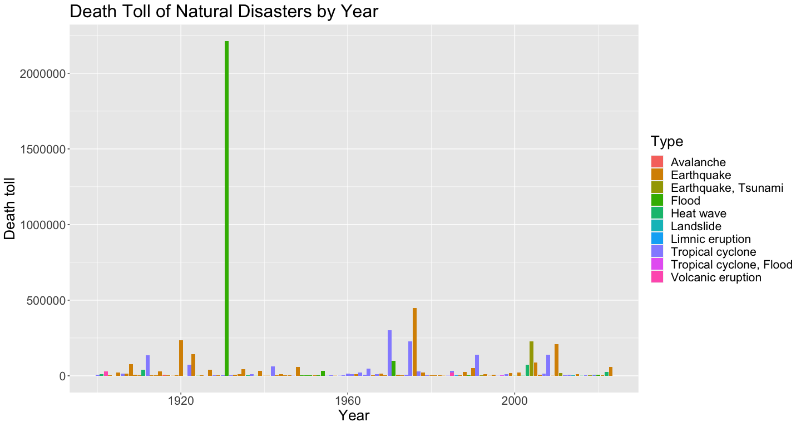
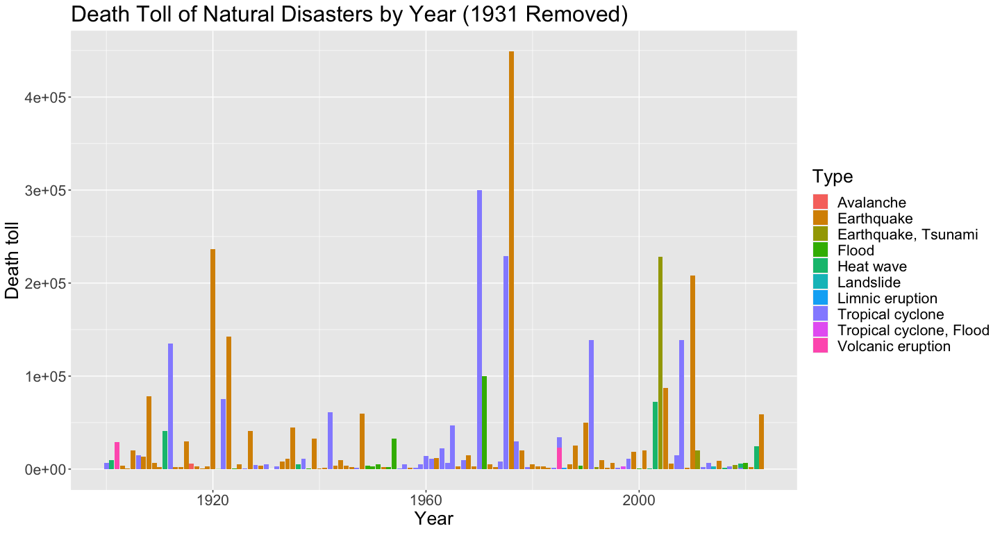
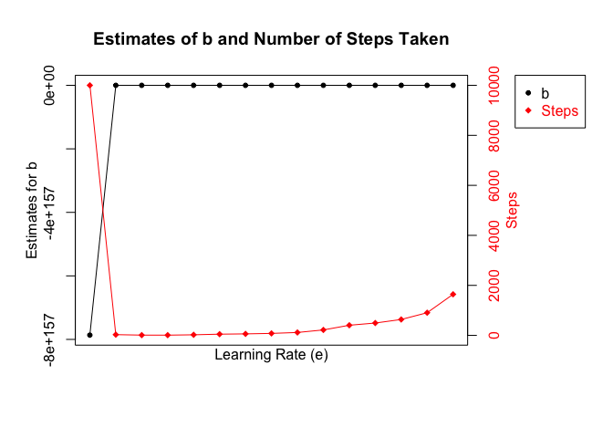

Data Science Assessment
================
Nora Liu
2023-08-21

``` r
library(rvest)
library(stringr)
library(dplyr)
```

    ## 
    ## Attaching package: 'dplyr'

    ## The following objects are masked from 'package:stats':
    ## 
    ##     filter, lag

    ## The following objects are masked from 'package:base':
    ## 
    ##     intersect, setdiff, setequal, union

``` r
library(ggplot2)
```

## Problem 1

``` r
html <- read_html("https://en.wikipedia.org/wiki/List_of_natural_disasters_by_death_toll") # read in
```
``` r
t_20 <- html_nodes(html, "table")[2] %>% html_table() # 20th century table
t_20 <- t_20[[1]]                                     # into dataframe
t_21 <- html_nodes(html, "table")[3] %>% html_table() # 21st century table
t_21 <- t_21[[1]]                                     # into dataframe
```

``` r
is.data.frame(t_20)
```

    ## [1] TRUE

``` r
is.data.frame(t_21)
```

    ## [1] TRUE

``` r
t <- rbind(t_20, t_21)   # merge
```

``` r
# take a look
knitr::kable(head(t_20, 3))
```

| Year | Death toll  | Event                                | Countries affected | Type              | Date         |
|-----:|:------------|:-------------------------------------|:-------------------|:------------------|:-------------|
| 1900 | 6,000–8,000 | 1900 Galveston hurricane             | United States      | Tropical cyclone  | September 9  |
| 1901 | 9,500       | 1901 eastern United States heat wave | United States      | Heat wave         | June–July    |
| 1902 | 29,000      | 1902 eruption of Mount Pelée         | Martinique         | Volcanic eruption | April–August |

``` r
knitr::kable(head(t_21, 3))
```

| Year | Death toll | Event                   | Countries affected | Type       | Date          |
|-----:|:-----------|:------------------------|:-------------------|:-----------|:--------------|
| 2001 | 20,005     | 2001 Gujarat earthquake | India              | Earthquake | January 26    |
| 2002 | 1,030      | 2002 Indian heat wave   | India              | Heat wave  | May           |
| 2003 | 72,000     | 2003 European heat wave | Europe             | Heat wave  | July – August |


``` r
# handling death toll
temp <- t$`Death toll`                              # placeholder so we do not directly work on t
temp <- str_replace_all(temp, "\\[\\S*\\]", "")     # remove brackets
temp <- str_replace_all(temp, ",", "")              # remove comma
temp <- str_replace_all(temp, "\\+|\\-$", "")       # remove plus sign (upper bound) and - sign for lower bound (just in case)
temp <- lapply(str_split(temp, "\\D+"), as.numeric) # as numeric
temp <- lapply(temp, function(x) {
  if (length(x) > 1) {
    mean(x)
  } else {
    x[1]
  }
})                                                  # take midpoint of two numbers
t$`Death toll` <- unlist(temp)                      # put back
```

Below we have a bar plot of death toll over the years. The different colors represent different types of natural disasters. The outstanding feature of this plot is the 1931 China floods that cause over 2 million deaths. And since this number is overwhelmingly high, the other bars are compressed. Nonetheless, we still get some sense that most of the high bars (meaning high death tolls in that year) are brown/orange and purple, representing earthquake and tsunami. So in the next plot, we are plotting the same graph without the 1931 disaster to get a better picture of other years' situations

``` r
ggplot(data=t, aes(x=Year, y=`Death toll`, fill=Type)) + 
  geom_bar(stat="identity") +
  ggtitle("Death Toll of Natural Disasters by Year")  + 
  theme(text = element_text(size = 20)) 
```

<!-- -->

In the following plot with 1931 disaster removed, we can see the top death tolls are 1976 Tangshan earthquake with over 400,000 deaths, 1970 Bhola cyclone with 300,000 deaths, 1920 Haiyuan earthquakes with over 200,000 deaths, 1975 Typhoon Nina with over 200,000 deaths.

The graphs give us a clear image that earthquake causes much higher damage than other disasters, followed by cyclone/typhoon in general. They both happen the most frequently, and cause higher number of deaths. Removing the 1931 disasters, the next most severe disasters are floods and heat waves, shown in green color in the plot. Volcanic eruption, avalanche, landslide, and limnic eruption are less frequent and less severe comparatively.

``` r
ggplot(data=t[t$`Death toll` < 2000000,], aes(x=Year, y=`Death toll`, fill=Type)) + 
  geom_bar(stat="identity")  +
  ggtitle("Death Toll of Natural Disasters by Year (1931 Removed)")  + 
  theme(text = element_text(size = 20)) 
```

<!-- -->


``` r
t[t$`Death toll` < 2000000,] %>% group_by(Type) %>% 
  summarise(count = n(), death = sum(`Death toll`)) %>%
  arrange(desc(count))
```

    ## # A tibble: 10 × 3
    ##    Type                    count   death
    ##    <chr>                   <int>   <dbl>
    ##  1 Earthquake                 58 1808636
    ##  2 Tropical cyclone           37 1341296
    ##  3 Flood                      12  160316
    ##  4 Heat wave                   8  158165
    ##  5 Earthquake, Tsunami         4  254487
    ##  6 Volcanic eruption           2   52000
    ##  7 Avalanche                   1    6000
    ##  8 Landslide                   1    2700
    ##  9 Limnic eruption             1    1746
    ## 10 Tropical cyclone, Flood     1    3123


## Problem 2

``` r
gradient_descent <- function(x, y, 
                             e = 0.001,        # learning rates
                             b_cur = 1,        # starting estimate of b
                             threshold = 1e-5, # stopping threshold
                             steps = 100000    # maximum number of steps in case of infinite loop
) {
  i <- 1
  for (i in seq_len(steps)) {
    y_pred <- b_cur * x                         # predicted y values
    l_derivative <- -2 * sum(x * (y-y_pred))    # derivative of loss function
    b_prev <- b_cur                             # saving the value of current b value
    b_cur <- b_cur - e * l_derivative           # update estimate of b with gradient descnet
    if (abs(b_cur - b_prev) < threshold) {      # test if threshold has been met
      break
    }
  }
  c(b_cur, i)                                   # output
}
```

Here we are testing our gradient descent function with a random generated vector of 10 numbers, and set gradient to be 3

``` r
# test
set.seed(9)
x <- rnorm(10, 10, 10)   # randomly generated normal vector of x
y <- x * 3
sum(x * y) / sum(x^2) # the solution
```

    ## [1] 3

``` r
e_vec <- c(seq(from = 0.001, by = -0.0002, length.out = 5),
           seq(from = 0.0001, by = -0.00002, length.out = 5),
           seq(from = 0.00001, by = -0.000002, length.out = 5))   # learning rates

b <- c()
steps <- c()

for (i in e_vec) {
  run <- gradient_descent(x, y, e = i)
  b <- c(b, run[1])
  steps <- c(steps, run[2])
}

rbind(e_vec, b, steps)
```

    ##                 [,1]      [,2]      [,3]     [,4]      [,5]      [,6]      [,7]
    ## e_vec   1.000000e-03  0.000800  0.000600 0.000400  0.000200  0.000100  0.000080
    ## b     -7.866203e+157  3.000003  2.999999 2.999999  2.999988  2.999964  2.999954
    ## steps   1.000000e+04 29.000000 10.000000 9.000000 23.000000 48.000000 60.000000
    ##            [,8]       [,9]      [,10]     [,11]      [,12]      [,13]
    ## e_vec  0.000060   0.000040   0.000020   0.00001   0.000008   0.000006
    ## b      2.999933   2.999895   2.999769   2.99952   2.999403   2.999197
    ## steps 79.000000 116.000000 218.000000 405.00000 494.000000 636.000000
    ##            [,14]       [,15]
    ## e_vec   0.000004    0.000002
    ## b       2.998792    2.997556
    ## steps 906.000000 1643.000000

Here we are testing our gradient descent algorithm on randomly generated vectors with a known value of **b = 3**. We see that as the learning rate **e** lowers (smaller step size), the estimates of b remains stable almost throughout, while the number of steps taken to reach that final estimates remains low and stable at first, and then increases exponentially. In a nutshell, the performance of the algorithm does not necessarily improves with a smaller step size/lower learning rate. In fact, a smaller step size will cause the number of steps taken to increase quite a lot, becoming computationally expensive.

The algorithms clearly fails at high learning rate/large step size till around $e=0.0008$. And any learning rate higher than this (larger step size) will likely cause the algorithm to fail as well. In these cases, the gradient descent **overshoots and misses** the real solution. With a large step size, every time we update the estimates for b, we change it by a lot. But again, whether or not the algorithm overshoots also depends on the initial value of b we chooses. Here we did not test multiple starting points. One last note is that since we are multiplying the derivative of L directly with learning rate, the number of points in the vector might also affect the learning rate at which the algorithm will fail.

``` r
par(mar=c(5, 4, 4, 8) + 0.3, xpd=TRUE)

plot(b, xlab="", ylab="", type="o", pch=20, axes=FALSE)
axis(2)
mtext("Estimates for b", side=2, line=2)
box()

par(new=TRUE)
plot(steps,  xlab="", ylab="", type="o", pch=18, col="red", axes=FALSE)
axis(4, col.axis="red")
mtext("Steps", side=4, line=2, col="red")

mtext("Learning Rate (e)", side=1)

title("Estimates of b and Number of Steps Taken")

legend("topright", inset = c(-0.3, 0), legend=c("b","Steps"), text.col=c("black","red"), pch=c(20,18), col=c("black","red"))
```

<!-- -->
