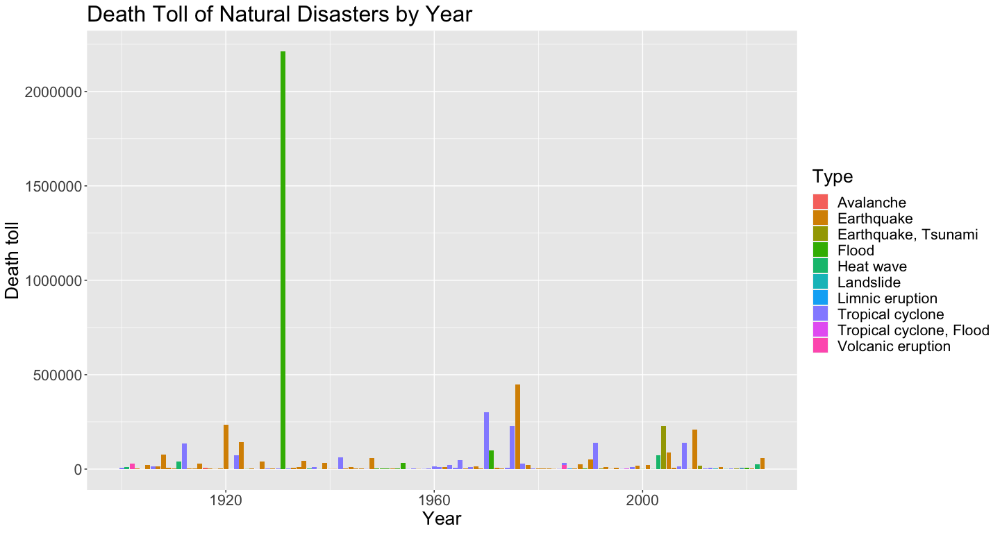
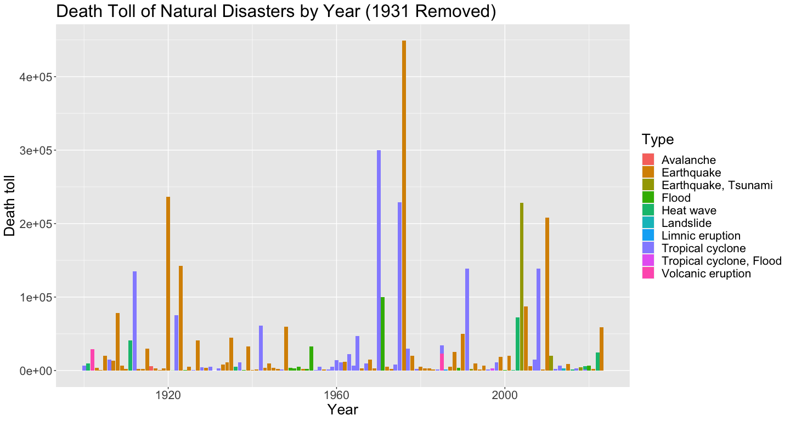
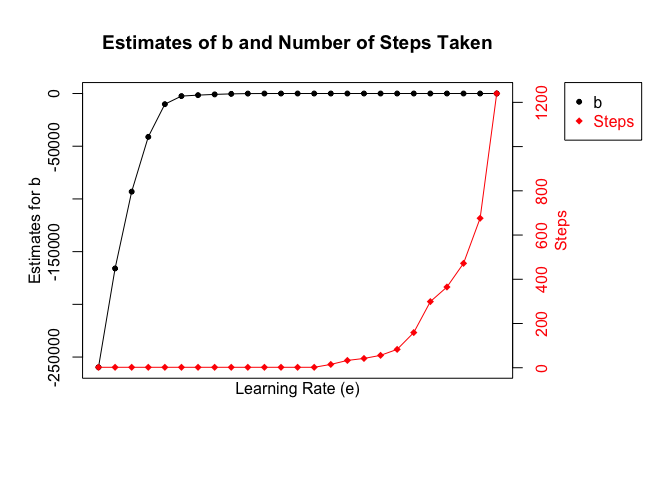

# Data Science Assessment

## Problem 1

In this question, we are seeing the death tolls of each year's deadliest natural disaster in the 20th and 21st century. Natural disasters include earthquakes, floods, cyclones, etc. Let's first take a quick look at some of the events in these years

| Year | Death toll  | Event                                | Countries affected | Type              | Date         |
|-----:|:------------|:-------------------------------------|:-------------------|:------------------|:-------------|
| 1900 | 6,000–8,000 | 1900 Galveston hurricane             | United States      | Tropical cyclone  | September 9  |
| 1901 | 9,500       | 1901 eastern United States heat wave | United States      | Heat wave         | June–July    |
| 1902 | 29,000      | 1902 eruption of Mount Pelée         | Martinique         | Volcanic eruption | April–August |

| Year | Death toll | Event                                    | Countries affected                                       | Type                | Date          |
|-----:|:-----------|:-----------------------------------------|:---------------------------------------------------------|:--------------------|:--------------|
| 2001 | 20,005     | 2001 Gujarat earthquake                  | India                                                    | Earthquake          | January 26    |
| 2002 | 1,030      | 2002 Indian heat wave                    | India                                                    | Heat wave           | May           |
| 2003 | 72,000     | 2003 European heat wave                  | Europe                                                   | Heat wave           | July – August |

Below we have a bar plot of death toll over the years. The different colors represent different types of natural disasters. The outstanding feature of this plot is the 1931 China floods that cause over 2 million deaths. And since this number is overwhelmingly high, the other bars are compressed. So in the next plot, we are plotting the same graph without the 1931 disaster to get a picture of other years' situations

<!-- -->

In the following plot, we can see the top death tolls are 1976 Tangshan earthquake with over 400,000 deaths, 1970 Bhola cyclone with 300,000 deaths, 1920 Haiyuan earthquakes with over 200,000 deaths, 1975 Typhoon Nina with over 200,000 deaths.

The graphs give us a clear image that earthquake causes much higher damage than other disasters, followed by cyclone/typhoon in general. They both happen the most frequently, and cases higher death tolls. Removing the 1931 disasters, the next most severe disasters are floods and heat waves, shown in green color in the plot. Volcanic eruption, avalanche, landslide, and limnic eruption are less frequent and less severe comparatively.

<!-- -->

## Problem 2

In this question, we are testing our gradient descent algorithm. Since the initial value, stopping threshold, and maximmum number of steps are not specified in the question, we are setting the values ourselves and setting them constant throughout this test.

Here we are testing our gradient descent algorithm on randomly generated vectors with a known value of **b = 3**. We are able to see that as the learning rate e lowers, the estimates of b remains stable for a while and then maybe drops a little, while the number of steps taken to reach that final estimates also remains at hundreds at first, and then increases exponentially. In a nutshell, the performance of the algorithm does not necessarily improves with a smaller step size/lower learning rate. In fact, a small step size will cause the number of steps taken to increase quite a lot, becoming computationally expensive.

The algorithms clearly fails at high learning rate till around 0.001. In these cases, the gradient descent overshoots and misses the real solution. With a big step size, every time we update the estimates for b, we change by a lot. But again, whether or not the algorithm overshoots also depends on the starting point we chooses. Here we did not test multiple starting points.

<!-- -->
